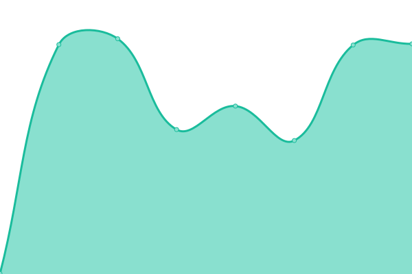
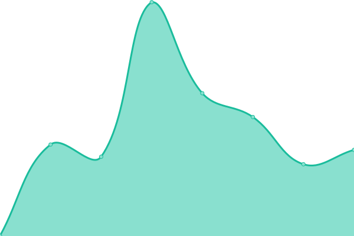
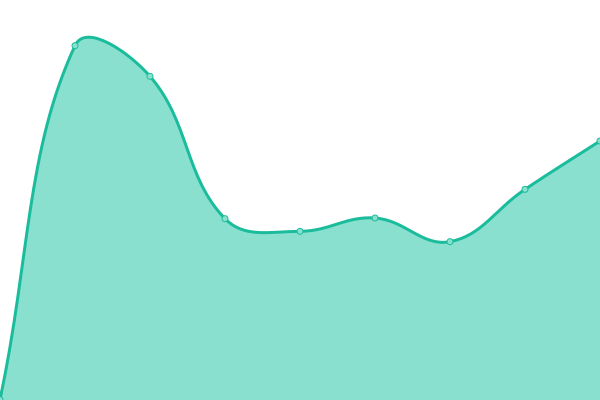

# [📈 Live Status](https://uptime.gh.gzod01.fr): <!--live status--> **🟧 Partial outage**

This repository contains the open-source uptime monitor and status page for [GZod01](https://gzod01.fr), powered by [Upptime](https://github.com/upptime/upptime).

With [Upptime](https://upptime.js.org), you can get your own unlimited and free uptime monitor and status page, powered entirely by a GitHub repository. We use [Issues](https://github.com/GZod01/gzod01-server-uptime/issues) as incident reports, [Actions](https://github.com/GZod01/gzod01-server-uptime/actions) as uptime monitors, and [Pages](https://uptime.gh.gzod01.fr) for the status page.

<!--start: status pages-->
<!-- This summary is generated by Upptime (https://github.com/upptime/upptime) -->
<!-- Do not edit this manually, your changes will be overwritten -->
<!-- prettier-ignore -->
| URL | Status | History | Response Time | Uptime |
| --- | ------ | ------- | ------------- | ------ |
|  [CyberGamma.Group](https://CyberGamma.group) | 🟥 Down | [cyber-gamma-group.yml](https://github.com/GZod01/gzod01-server-uptime/commits/HEAD/history/cyber-gamma-group.yml) | 

 1013ms
     
 | 

<a href="https://uptime.gh.gzod01.fr/history/cyber-gamma-group">97.76%</a>
    

|  [GZod01.Fr](https://gzod01.fr) | 🟥 Down | [g-zod01-fr.yml](https://github.com/GZod01/gzod01-server-uptime/commits/HEAD/history/g-zod01-fr.yml) | 

 666ms
     
 | 

<a href="https://uptime.gh.gzod01.fr/history/g-zod01-fr">97.81%</a>
    

|  [IGSTV.gzod01.fr](https://igstv.gzod01.fr) | 🟥 Down | [igstv-gzod01-fr.yml](https://github.com/GZod01/gzod01-server-uptime/commits/HEAD/history/igstv-gzod01-fr.yml) | 

 1134ms
     
 | 

<a href="https://uptime.gh.gzod01.fr/history/igstv-gzod01-fr">97.82%</a>
    

|  [Chips.CyberGamma.group (SyllChips website)](https://chips.cybergamma.group) | 🟩 Up | [chips-cyber-gamma-group-syll-chips-website.yml](https://github.com/GZod01/gzod01-server-uptime/commits/HEAD/history/chips-cyber-gamma-group-syll-chips-website.yml) | 

 1185ms
     
 | 

<a href="https://uptime.gh.gzod01.fr/history/chips-cyber-gamma-group-syll-chips-website">97.96%</a>
    

|  [APPS.CyberGamma.Group (CyberGammApps)](https://apps.cybergamma.group) | 🟩 Up | [apps-cyber-gamma-group-cyber-gamm-apps.yml](https://github.com/GZod01/gzod01-server-uptime/commits/HEAD/history/apps-cyber-gamma-group-cyber-gamm-apps.yml) | 

 1396ms
     
 | 

<a href="https://uptime.gh.gzod01.fr/history/apps-cyber-gamma-group-cyber-gamm-apps">98.08%</a>
    

|  [Forge.CyberGamma.Group (CyberGammaForge)](https://forge.cybergamma.group) | 🟥 Down | [forge-cyber-gamma-group-cyber-gamma-forge.yml](https://github.com/GZod01/gzod01-server-uptime/commits/HEAD/history/forge-cyber-gamma-group-cyber-gamma-forge.yml) | 

 612ms
     
 | 

<a href="https://uptime.gh.gzod01.fr/history/forge-cyber-gamma-group-cyber-gamma-forge">98.07%</a>
    

|  [Mail.cybergamma.group (CyberGammaMail)](https://mail.cybergamma.group) | 🟥 Down | [mail-cybergamma-group-cyber-gamma-mail.yml](https://github.com/GZod01/gzod01-server-uptime/commits/HEAD/history/mail-cybergamma-group-cyber-gamma-mail.yml) | 

 916ms
     
 | 

<a href="https://uptime.gh.gzod01.fr/history/mail-cybergamma-group-cyber-gamma-mail">97.96%</a>
    

|  [Stellae-Auri.cybergamma.group (Stellae Auri Website)](https://stellae-auri.cybergamma.group) | 🟩 Up | [stellae-auri-cybergamma-group-stellae-auri-website.yml](https://github.com/GZod01/gzod01-server-uptime/commits/HEAD/history/stellae-auri-cybergamma-group-stellae-auri-website.yml) | 

 754ms
     
 | 

<a href="https://uptime.gh.gzod01.fr/history/stellae-auri-cybergamma-group-stellae-auri-website">97.97%</a>
    

<!--end: status pages-->

[**Visit our status website →**](https://uptime.gh.gzod01.fr)

## 📄 License

- Powered by: [Upptime](https://github.com/upptime/upptime)
- Code: [MIT](./LICENSE) © [Anand Chowdhary](https://anandchowdhary.com), supported by [Pabio](https://pabio.com)
- Data in the `./history` directory: [Open Database License](https://opendatacommons.org/licenses/odbl/1-0/)
