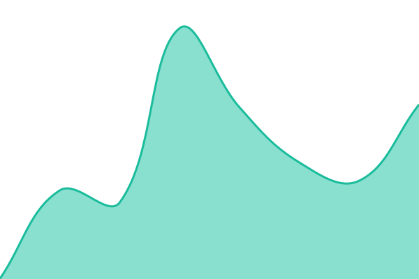
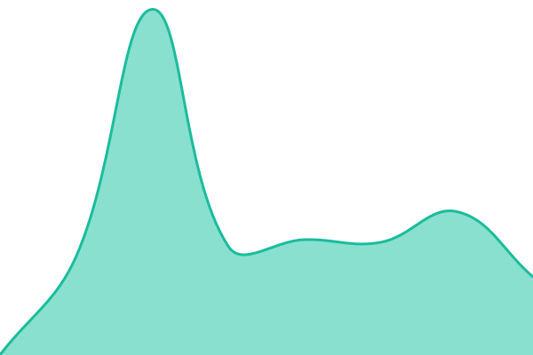

# [📈 Live Status](https://uptime.gh.gzod01.fr): <!--live status--> **🟧 Partial outage**

This repository contains the open-source uptime monitor and status page for [GZod01](https://gzod01.fr), powered by [Upptime](https://github.com/upptime/upptime).

With [Upptime](https://upptime.js.org), you can get your own unlimited and free uptime monitor and status page, powered entirely by a GitHub repository. We use [Issues](https://github.com/GZod01/gzod01-server-uptime/issues) as incident reports, [Actions](https://github.com/GZod01/gzod01-server-uptime/actions) as uptime monitors, and [Pages](https://uptime.gh.gzod01.fr) for the status page.

<!--start: status pages-->
<!-- This summary is generated by Upptime (https://github.com/upptime/upptime) -->
<!-- Do not edit this manually, your changes will be overwritten -->
<!-- prettier-ignore -->
| URL | Status | History | Response Time | Uptime |
| --- | ------ | ------- | ------------- | ------ |
|  [Sezille.net Main Server](https://sezille.net) | 🟩 Up | [sezille-net-main-server.yml](https://github.com/GZod01/gzod01-server-uptime/commits/HEAD/history/sezille-net-main-server.yml) | 

 532ms
     
 | 

<a href="https://uptime.gh.gzod01.fr/history/sezille-net-main-server">100.00%</a>
    

|  [CyberGammaGroup Websites VM](websites.vm.cybergamma.group) | 🟩 Up | [cyber-gamma-group-websites-vm.yml](https://github.com/GZod01/gzod01-server-uptime/commits/HEAD/history/cyber-gamma-group-websites-vm.yml) | 

 884ms
     
 | 

<a href="https://uptime.gh.gzod01.fr/history/cyber-gamma-group-websites-vm">100.00%</a>
    

|  [CyberGammaGroup](https://cybergamma.group) | 🟩 Up | [cyber-gamma-group.yml](https://github.com/GZod01/gzod01-server-uptime/commits/HEAD/history/cyber-gamma-group.yml) | 

 535ms
     
 | 

<a href="https://uptime.gh.gzod01.fr/history/cyber-gamma-group">37.53%</a>
    

|  [CyberGammApps](https://apps.cybergamma.group) | 🟩 Up | [cyber-gamm-apps.yml](https://github.com/GZod01/gzod01-server-uptime/commits/HEAD/history/cyber-gamm-apps.yml) | 

 649ms
     
 | 

<a href="https://uptime.gh.gzod01.fr/history/cyber-gamm-apps">37.53%</a>
    

|  [CyberGammaForge VM](forge.vm.cybergamma.group) | 🟩 Up | [cyber-gamma-forge-vm.yml](https://github.com/GZod01/gzod01-server-uptime/commits/HEAD/history/cyber-gamma-forge-vm.yml) | 

 445ms
     
 | 

<a href="https://uptime.gh.gzod01.fr/history/cyber-gamma-forge-vm">100.00%</a>
    

|  [CyberGammaForge](https://forge.cybergamma.group) | 🟩 Up | [cyber-gamma-forge.yml](https://github.com/GZod01/gzod01-server-uptime/commits/HEAD/history/cyber-gamma-forge.yml) | 

 632ms
     
 | 

<a href="https://uptime.gh.gzod01.fr/history/cyber-gamma-forge">100.00%</a>
    

|  [CyberGammaGroup Communications VM](comm.vm.cybergamma.group) | 🟩 Up | [cyber-gamma-group-communications-vm.yml](https://github.com/GZod01/gzod01-server-uptime/commits/HEAD/history/cyber-gamma-group-communications-vm.yml) | 

 352ms
     
 | 

<a href="https://uptime.gh.gzod01.fr/history/cyber-gamma-group-communications-vm">100.00%</a>
    

|  [CyberGammaMail](https://mail.cybergamma.group) | 🟩 Up | [cyber-gamma-mail.yml](https://github.com/GZod01/gzod01-server-uptime/commits/HEAD/history/cyber-gamma-mail.yml) | 

 944ms
     
 | 

<a href="https://uptime.gh.gzod01.fr/history/cyber-gamma-mail">100.00%</a>
    

|  [CyberGammaGroup Matrix VM](matrix.vm.cybergamma.group) | 🟥 Down | [cyber-gamma-group-matrix-vm.yml](https://github.com/GZod01/gzod01-server-uptime/commits/HEAD/history/cyber-gamma-group-matrix-vm.yml) | 

 292ms
     
 | 

<a href="https://uptime.gh.gzod01.fr/history/cyber-gamma-group-matrix-vm">0.00%</a>
    

|  [CyberGammaChat](https://ess.cybergamma.group) | 🟩 Up | [cyber-gamma-chat.yml](https://github.com/GZod01/gzod01-server-uptime/commits/HEAD/history/cyber-gamma-chat.yml) | 

 1001ms
     
 | 

<a href="https://uptime.gh.gzod01.fr/history/cyber-gamma-chat">100.00%</a>
    

|  [CyberGammaGroup Services VM](services.vm.cybergamma.group) | 🟩 Up | [cyber-gamma-group-services-vm.yml](https://github.com/GZod01/gzod01-server-uptime/commits/HEAD/history/cyber-gamma-group-services-vm.yml) | 

 351ms
     
 | 

<a href="https://uptime.gh.gzod01.fr/history/cyber-gamma-group-services-vm">100.00%</a>
    

|  [CyberGammaCloud](https://nc.cybergamma.group) | 🟩 Up | [cyber-gamma-cloud.yml](https://github.com/GZod01/gzod01-server-uptime/commits/HEAD/history/cyber-gamma-cloud.yml) | 

 1020ms
     
 | 

<a href="https://uptime.gh.gzod01.fr/history/cyber-gamma-cloud">100.00%</a>
    

|  [Home Assistant Sezille.net VM](https://haos.sezille.net) | 🟥 Down | [home-assistant-sezille-net-vm.yml](https://github.com/GZod01/gzod01-server-uptime/commits/HEAD/history/home-assistant-sezille-net-vm.yml) | 

 503ms
     
 | 

<a href="https://uptime.gh.gzod01.fr/history/home-assistant-sezille-net-vm">86.69%</a>
    

|  [Home Assistant Sezille.net](https://haos.sezille.net) | 🟥 Down | [home-assistant-sezille-net.yml](https://github.com/GZod01/gzod01-server-uptime/commits/HEAD/history/home-assistant-sezille-net.yml) | 

 117ms
     
 | 

<a href="https://uptime.gh.gzod01.fr/history/home-assistant-sezille-net">86.69%</a>
    

<!--end: status pages-->

[**Visit our status website →**](https://uptime.gh.gzod01.fr)

## 📄 License

- Powered by: [Upptime](https://github.com/upptime/upptime)
- Code: [MIT](./LICENSE) © [Anand Chowdhary](https://anandchowdhary.com), supported by [Pabio](https://pabio.com)
- Data in the `./history` directory: [Open Database License](https://opendatacommons.org/licenses/odbl/1-0/)
