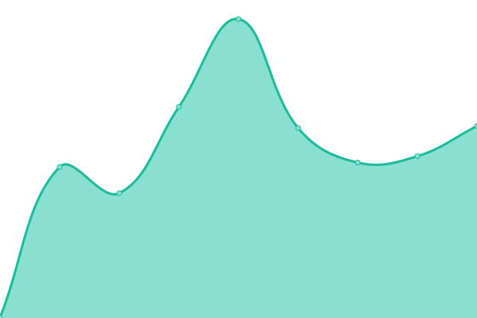

# [📈 Live Status](https://uptime.gh.gzod01.fr): <!--live status--> **🟧 Partial outage**

This repository contains the open-source uptime monitor and status page for [GZod01](https://gzod01.fr), powered by [Upptime](https://github.com/upptime/upptime).

With [Upptime](https://upptime.js.org), you can get your own unlimited and free uptime monitor and status page, powered entirely by a GitHub repository. We use [Issues](https://github.com/GZod01/gzod01-server-uptime/issues) as incident reports, [Actions](https://github.com/GZod01/gzod01-server-uptime/actions) as uptime monitors, and [Pages](https://uptime.gh.gzod01.fr) for the status page.

<!--start: status pages-->
<!-- This summary is generated by Upptime (https://github.com/upptime/upptime) -->
<!-- Do not edit this manually, your changes will be overwritten -->
<!-- prettier-ignore -->
| URL | Status | History | Response Time | Uptime |
| --- | ------ | ------- | ------------- | ------ |
|  [Sézille.Net](https://sezille.net) | 🟩 Up | [sezille-net.yml](https://github.com/GZod01/gzod01-server-uptime/commits/HEAD/history/sezille-net.yml) | 

 462ms
     
 | 

<a href="https://uptime.gh.gzod01.fr/history/sezille-net">100.00%</a>
    

|  [CyberGamma.Group](https://CyberGamma.group) | 🟩 Up | [cybergamma-group.yml](https://github.com/GZod01/gzod01-server-uptime/commits/HEAD/history/cybergamma-group.yml) | 

 527ms
     
 | 

<a href="https://uptime.gh.gzod01.fr/history/cybergamma-group">100.00%</a>
    

|  [Gzod01.Fr](https://gzod01.fr) | 🟩 Up | [gzod01-fr.yml](https://github.com/GZod01/gzod01-server-uptime/commits/HEAD/history/gzod01-fr.yml) | 

 599ms
     
 | 

<a href="https://uptime.gh.gzod01.fr/history/gzod01-fr">100.00%</a>
    

|  [IGSTV.gzod01.fr](https://igstv.gzod01.fr) | 🟥 Down | [igstv-gzod01-fr.yml](https://github.com/GZod01/gzod01-server-uptime/commits/HEAD/history/igstv-gzod01-fr.yml) | 

 0ms
     
 | 

<a href="https://uptime.gh.gzod01.fr/history/igstv-gzod01-fr">22.69%</a>
    

|  [Chips.CyberGamma.group (SyllChips website)](https://chips.cybergamma.group) | 🟥 Down | [chips-cyber-gamma-group-syll-chips-website.yml](https://github.com/GZod01/gzod01-server-uptime/commits/HEAD/history/chips-cyber-gamma-group-syll-chips-website.yml) | 

 575ms
     
 | 

<a href="https://uptime.gh.gzod01.fr/history/chips-cyber-gamma-group-syll-chips-website">22.69%</a>
    

|  [CyberGammApps](https://apps.cybergamma.group) | 🟩 Up | [cybergammapps.yml](https://github.com/GZod01/gzod01-server-uptime/commits/HEAD/history/cybergammapps.yml) | 

 601ms
     
 | 

<a href="https://uptime.gh.gzod01.fr/history/cybergammapps">100.00%</a>
    

|  [CyberGammaForge](https://forge.cybergamma.group) | 🟩 Up | [cybergammaforge.yml](https://github.com/GZod01/gzod01-server-uptime/commits/HEAD/history/cybergammaforge.yml) | 

 561ms
     
 | 

<a href="https://uptime.gh.gzod01.fr/history/cybergammaforge">100.00%</a>
    

|  [Mail.cybergamma.group (CyberGammaMail)](https://mail.cybergamma.group) | 🟩 Up | [mail-cybergamma-group-cyber-gamma-mail.yml](https://github.com/GZod01/gzod01-server-uptime/commits/HEAD/history/mail-cybergamma-group-cyber-gamma-mail.yml) | 

 6553ms
     
 | 

<a href="https://uptime.gh.gzod01.fr/history/mail-cybergamma-group-cyber-gamma-mail">70.57%</a>
    

|  [Stellae-Auri.cybergamma.group (Stellae Auri Website)](https://stellae-auri.cybergamma.group) | 🟩 Up | [stellae-auri-cybergamma-group-stellae-auri-website.yml](https://github.com/GZod01/gzod01-server-uptime/commits/HEAD/history/stellae-auri-cybergamma-group-stellae-auri-website.yml) | 

 517ms
     
 | 

<a href="https://uptime.gh.gzod01.fr/history/stellae-auri-cybergamma-group-stellae-auri-website">100.00%</a>
    

|  [Test](https://budget.cybergamma.group) | 🟥 Down | [test.yml](https://github.com/GZod01/gzod01-server-uptime/commits/HEAD/history/test.yml) | 

 0ms
     
 | 

<a href="https://uptime.gh.gzod01.fr/history/test">0.00%</a>
    

<!--end: status pages-->

[**Visit our status website →**](https://uptime.gh.gzod01.fr)

## 📄 License

- Powered by: [Upptime](https://github.com/upptime/upptime)
- Code: [MIT](./LICENSE) © [Anand Chowdhary](https://anandchowdhary.com), supported by [Pabio](https://pabio.com)
- Data in the `./history` directory: [Open Database License](https://opendatacommons.org/licenses/odbl/1-0/)
